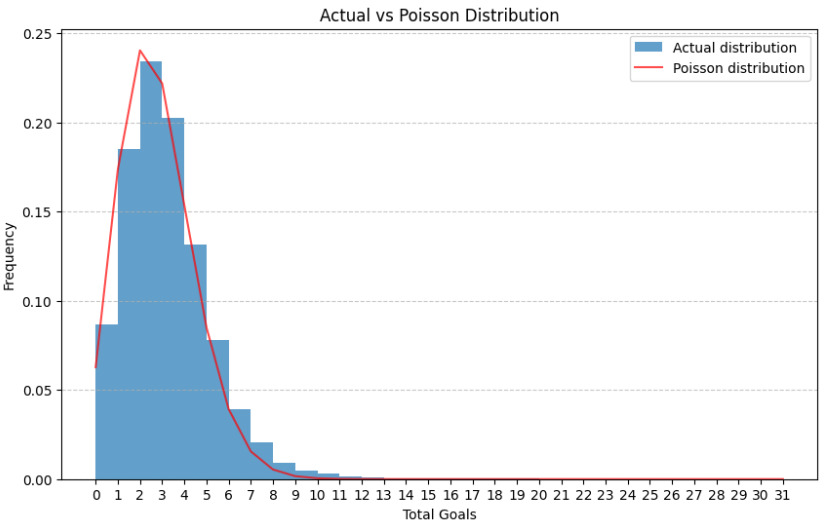
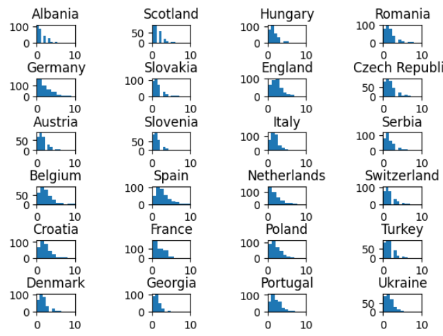
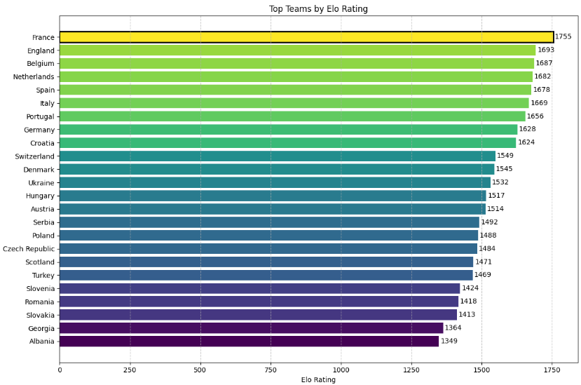
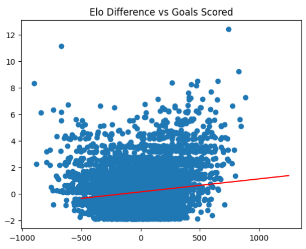
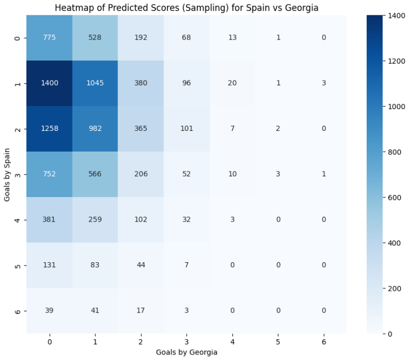
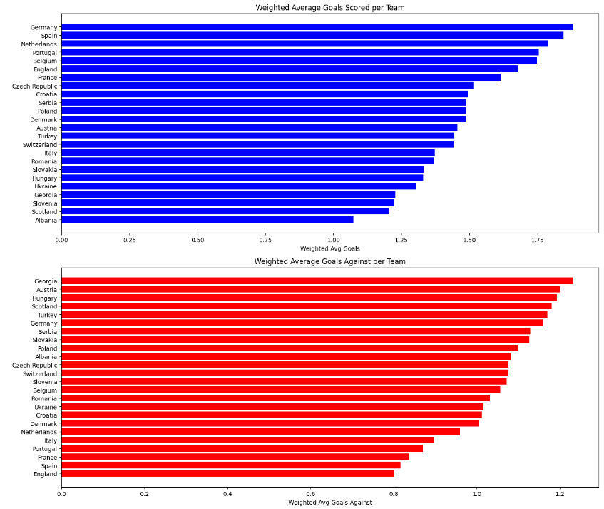
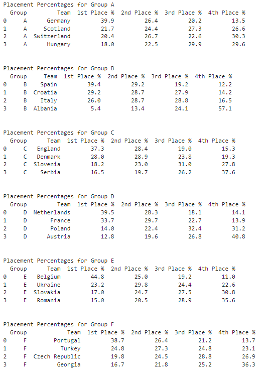

# Euro 2024 Predictor

This repository contains code and resources for predicting the outcomes of the Euro 2024 football tournament using various machine learning models and statistical methods.

## Features

- **Data Preparation**: Scripts to preprocess and clean the data.
- **ELO Calculation**: Code to calculate ELO ratings for teams.
- **Goal Distribution**: Analysis of goal distributions.
- **Correlation Analysis**: Studying the correlation between goals and ELO ratings.
- **Model Training and Testing**: Jupyter Notebooks and Python scripts to train, test, and evaluate models.
- **Prediction**: Scripts to predict match outcomes using trained models.

## Installation

1. Clone the repository:
    ```sh
    git clone https://github.com/iamk-cper/euro-2024-predictor.git
    ```
2. Navigate to the project directory:
    ```sh
    cd euro-2024-predictor
    ```
3. Install the required packages:
    ```sh
    pip install -r requirements.txt
    ```

## Usage

### Data Preparation

Prepare the data for analysis and modeling:
```sh
python data_preparation.py
```

### Calculate ELO Ratings

Calculate the ELO ratings for the teams:
```sh
python elo_calculation.py
```

### Analyze Goal Distribution

Analyze the goal distributions in the dataset:
```sh
python goal_distribution.py
```

### Train Models

Train the machine learning models using the prepared data:
```sh
python model_train.py
```

### Test Models

Evaluate the performance of the trained models:
```sh
python model_test.py
```

### Make Predictions

Use the trained models to predict the outcomes of matches:
```sh
python model_predict.py
```

### or just use model.ipynb file in jupyter notebook...

## Examples

### Goal Distribution Analysis



### Team goals distribution



### ELO Ratings



### Elo and goals correlation



### Match score heatmap



### Relative offensive and defensive power of teams



### Results




## Dataset

### International football results from 1872 to 2024

https://www.kaggle.com/datasets/martj42/international-football-results-from-1872-to-2017/data?select=results.csv


## Technologies

1. Python
2. Jupyter notebook
3. Frameworks: pandas, numpy, matplotlib, scipy, sklearn, seaborn
